# Automated CI/CD in practice

GitHub Actions is a continuous integration and continuous delivery (CI/CD) platform that allows you to automate your build, test, and deployment pipeline. You can create workflows that build and test every pull request to your repository, or deploy merged pull requests to production.

GitHub Actions goes beyond just DevOps and lets you run workflows when other events happen in your repository. For example, you can run a workflow to automatically add the appropriate labels whenever someone creates a new issue in your repository.

This document introduces pratical cases of CI/CD pipelines implemented in GitHub Action

1. The architecture of CI/CD automation 
2. Workflows for build and test
3. Workflows for build, test and deploy
4. Workflows for tests
5. Workflows for security test

## 1. The architecture of CI/CD automation 

This diagram presents key components and preconfigured pipelines 

It covers 

* Automated build and unit test 
* Automated deployment with required verification
* Automated static test for the Java code 
* Automated functional tests for the apps and the APIs 
* Automated load tests for the apps 
* Synthetic monitoring for the APIs 
* Automated security test for the app

## 2. Workflows for Build and Test (CI)

Pipeline looks like this in `.github/workflows/ci-build-test-all-customer.yml`

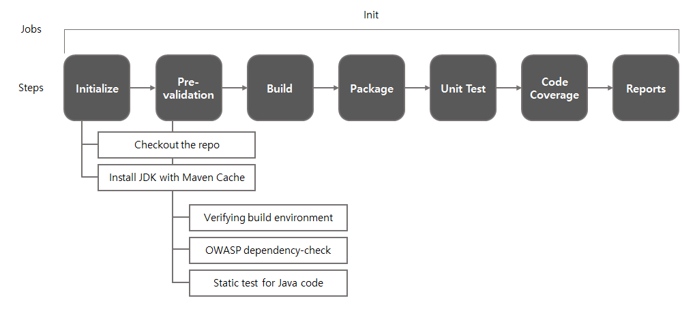

- Single job in the workflow
- No cache's required
- Includes pre-validation steps
  - Verifing build environment such as JDK type and version, Maven version and so on
  - OWASP dependency-check, checks vulnarabilities from all dependencies in the Maven project
  - Static test for Java code
- Code coverage (JaCoCo)

SonarQube plugin's preferred which can be easily integrated to JaCoCo

Environment verification by enforcer plugin

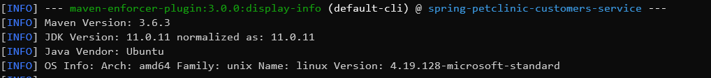

OWASP vulnarability check by dependency-check plugin

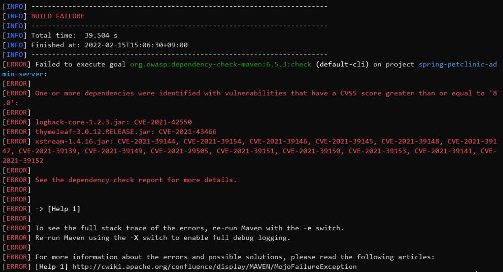

Vulnarability checks for Java code by SpotBugs plugin what it looks like on the console, on succeed

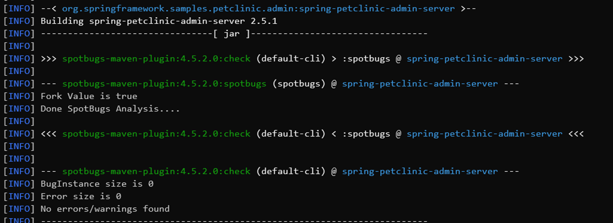

What it looks like on the report in XML format, on succeed

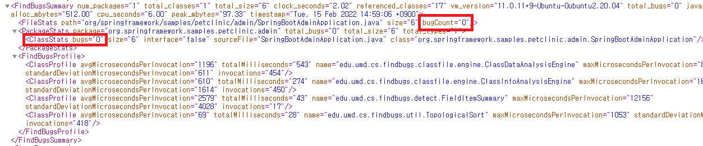

What it looks like on the console, on failure

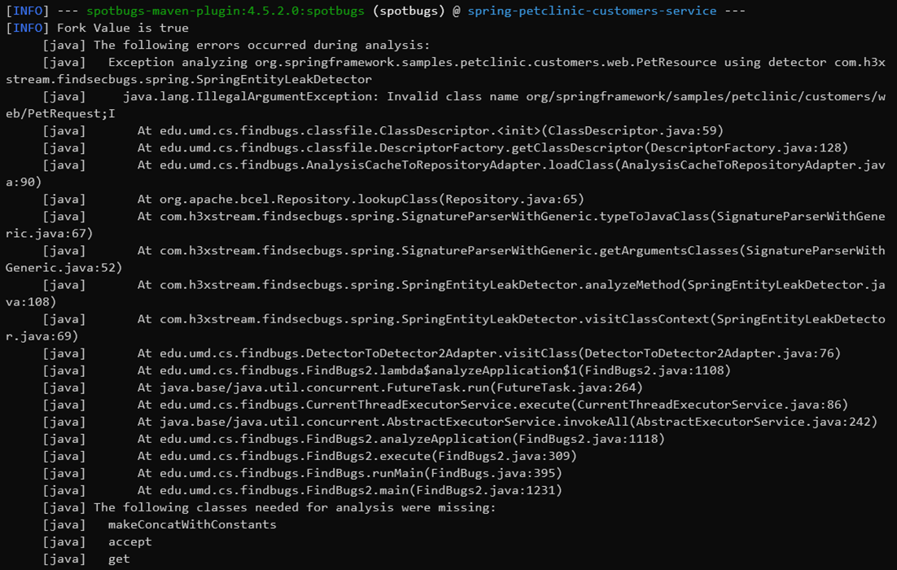

What it looks like on the report, on failure. Listed by methods, fields, classes and so on

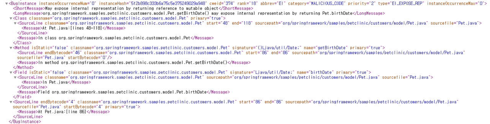

Unit test results which defined in JUnit, on succeed

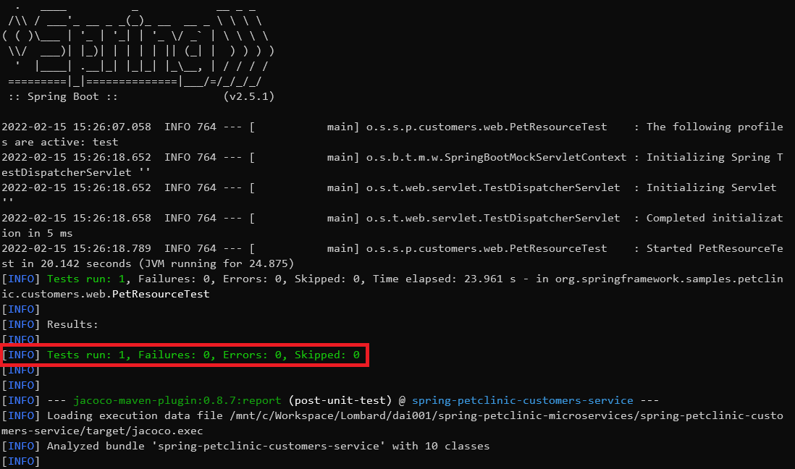

Code coverage report by JaCoCo plugin, overview

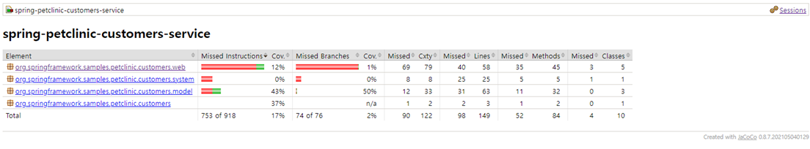

Browse by classes (code)

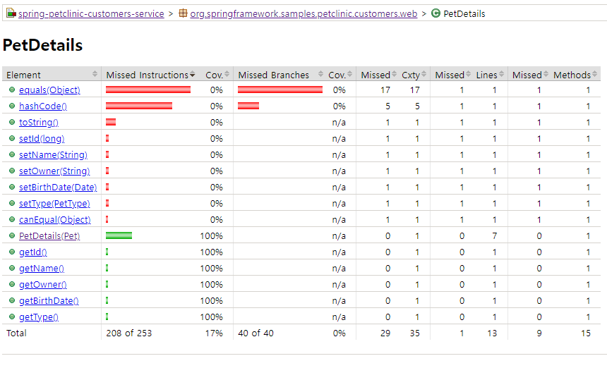

Browse by instances (runtime)

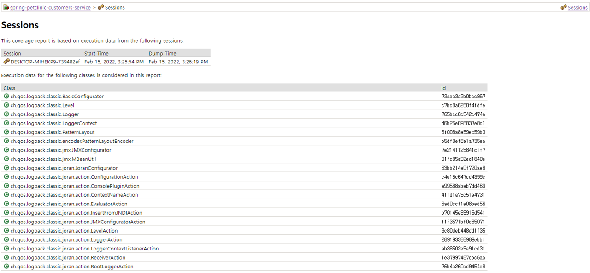

## 3. Workflows for Build, Test and Deploy (CI/CD)
## 4. Workflows for Continuous Validation (CV)
## 5. Workflows for Security Test (CV)

## Trademarks

This project may contain trademarks or logos for projects, products, or services. Authorized use of Microsoft trademarks or logos is subject to and must follow [Microsoft's Trademark & Brand Guidelines](https://www.microsoft.com/en-us/legal/intellectualproperty/trademarks/usage/general). Use of Microsoft trademarks or logos in modified versions of this project must not cause confusion or imply Microsoft sponsorship. Any use of third-party trademarks or logos are subject to those third-party's policies.