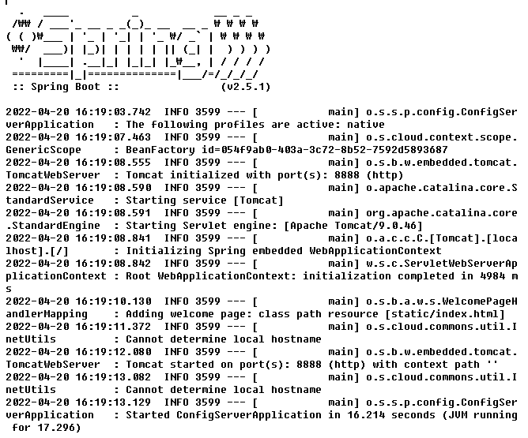
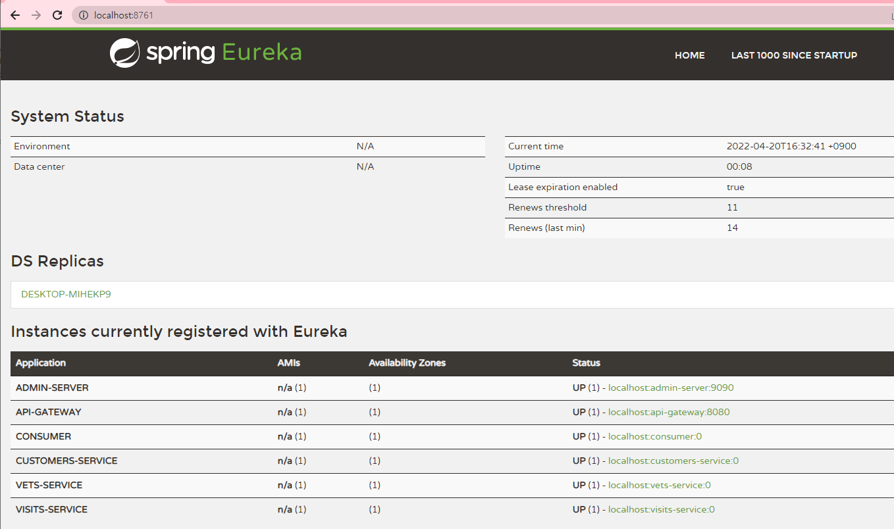
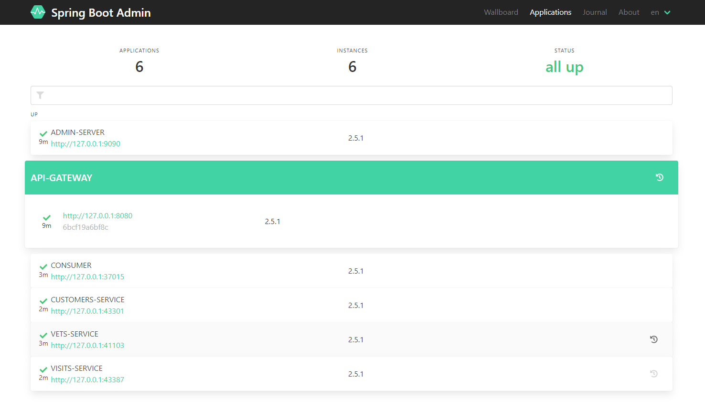
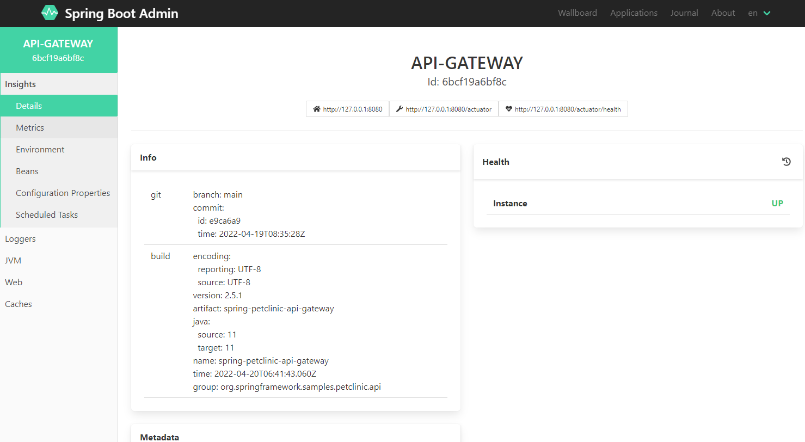
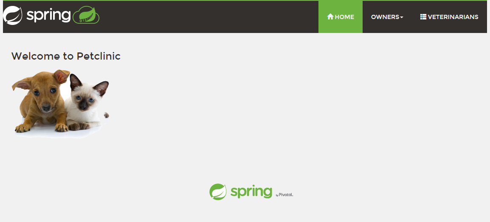
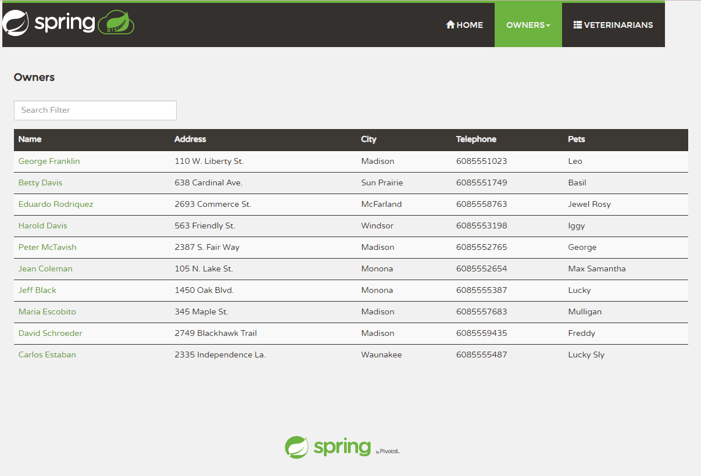

# Running PetClinic app locally

First you need to work through all steps to [Configure config-server by Azure Spring Cloud](README.md#configure-config-server-by-azure-spring-cloud) in the previous document [here](README.md)

Run server/services in sequence

1. config-server 
2. discovery-server 
3. api-gateway 
4. admin-server 
5. consumer 
6. customers-service 
7. vets-service 
8. visits-service 

Be careful that `discovery-server` and `api-gateway` requires `config-server`, and rest of servers/services requires `discovery-server` and `api-gateway`

From the commandline, start `config-server`

```

bin/run.sh config-server

```

It normally takes minutes. Check `config-server` logs from `logs`



Start `discovery-server`, `api-gateway` and `admin-server`

```

bin/run.sh discovery-server api-gateway
bin/run.sh admin-server

```

Then, you can run all the rest at once

```

bin/run.sh customers-service vets-service visits-service consumer 

```

After all instances up, open `http://localhost:8761/` from your web browser for Eureka Dashboard



Open `http://localhost:9090/` for Spring Boot Admin Console




And open `http://localhost:8080/` for PetClinic app




