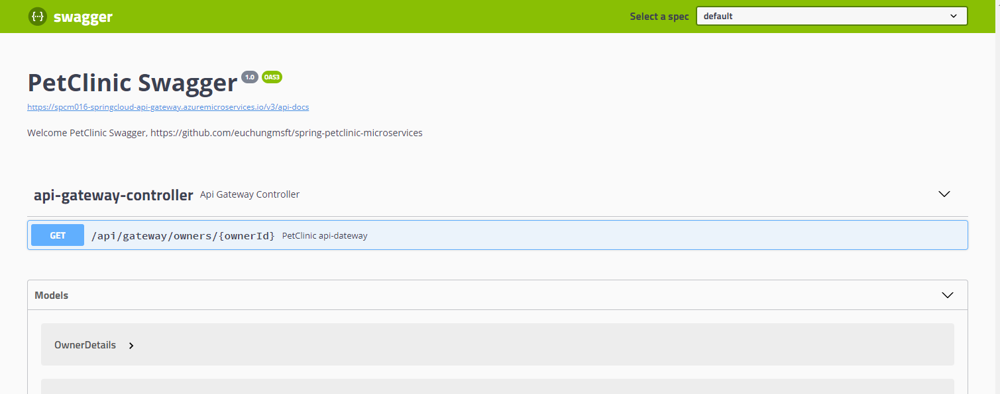
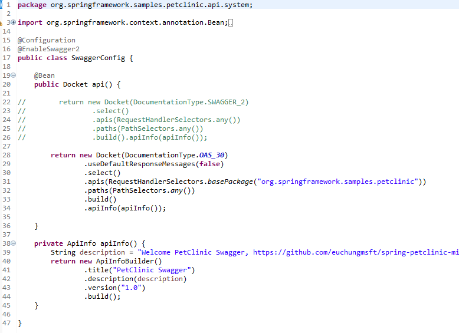
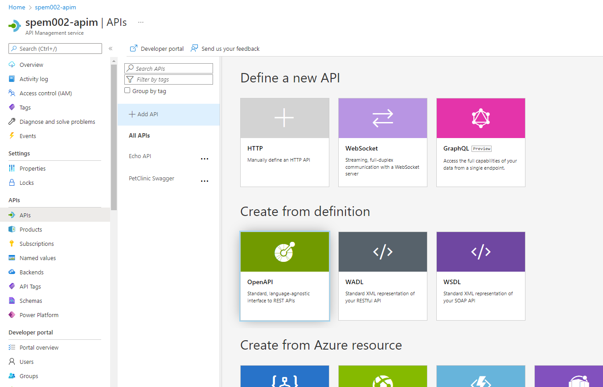
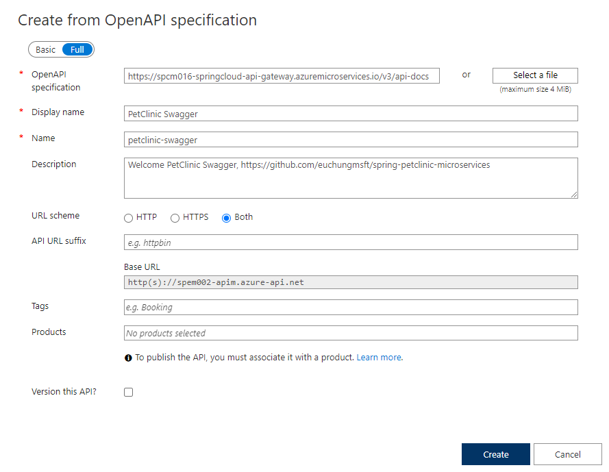
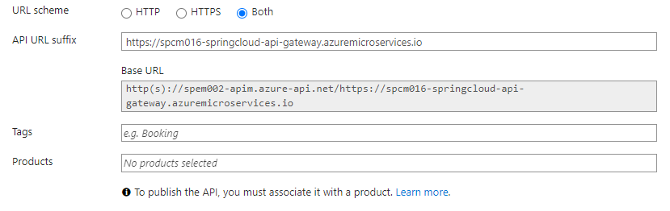
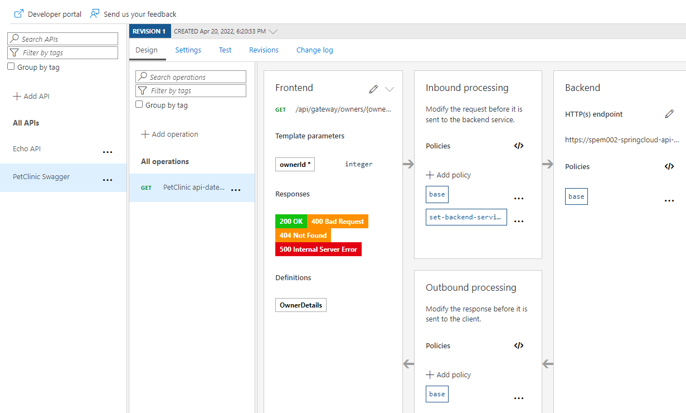
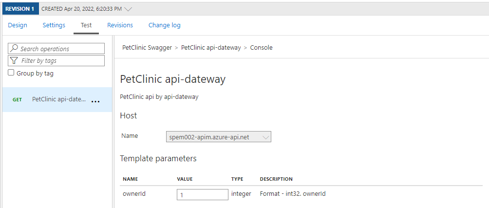
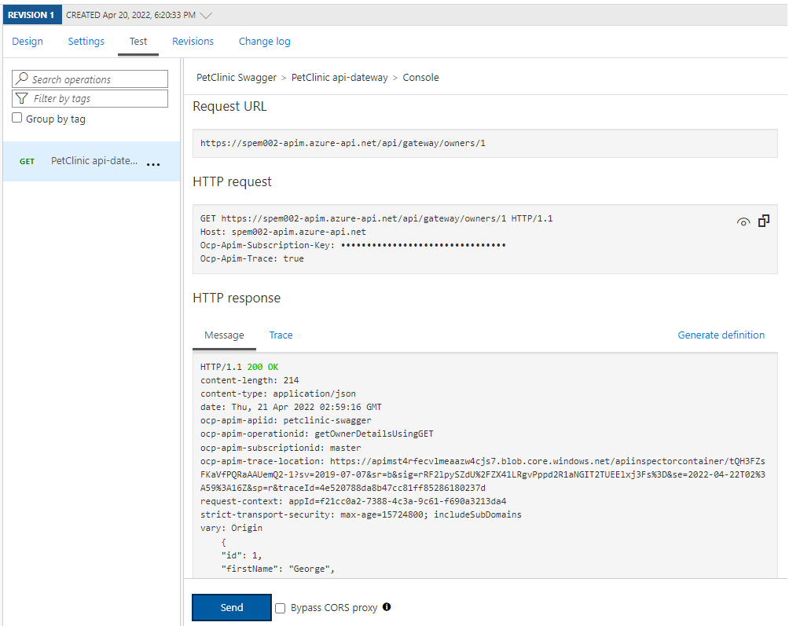

# PetClinic Swagger/OAS3 for API Management Integration

Before you start, you need to deploy PetClinic app by working through all steps listed in the previous document [here](README.md) and check everything works fine in your environment

Let's check Swagger UI first. [SpringFox](https://springfox.github.io/springfox/) is instrumented in this example for `api-gateway` and all three services `customers-service`, `vets-service`, `visits-service`

Open `https://[Your project name]-springcloud-api-gateway.azuremicroservices.io/swagger-ui.html` 

And check the source code `org.springframework.samples.petclinic.api.system.SwaggerConfig` at `api-gateway`

If you want to make some changes in header part of this Swagger UI, check `apiInfo()` method. Bean `api()` is to define version and scope of the api. In this example, it's on `OAS3`, Open API 3.0 and selects all APIs under `org.springframework.samples.petclinic` in this module

> Note: Azure API Management supports Open API 3. See [this](https://azure.microsoft.com/ko-kr/blog/announcing-the-preview-of-openapi-specification-v3-support-in-azure-api-management/) for further details

From your APIM portal, click on the APIM instance that you created, and 'APIs' blade on the left, and click on 'Open API' item under 'Create from definition'

Click on 'Full' on top left. Copy API document URL from Swagger URL and paste it to 'OpenAPI specification'. It automatically fetches Display name, Name and Description

Put 'API URL Suffix' such as `https://[Your project name]-springcloud-api-gateway.azuremicroservices.io` 

And click on 'Create' button. That's it !

Find `PetClinic Swagger API` from 'APIs'. It will look like this

Click on 'Test' tab, and put '1' for 'ouwnerId'. We're trying to test `customers/owners` api over this APIM

And click on 'Send'

Done